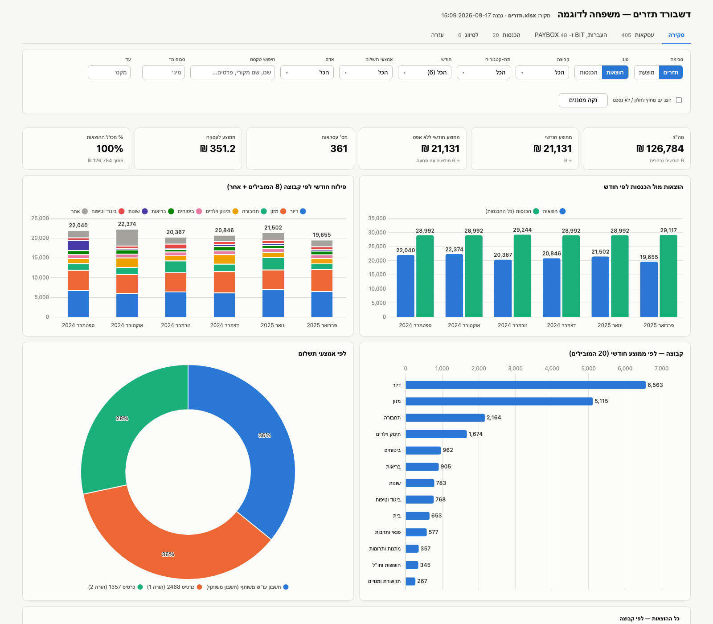
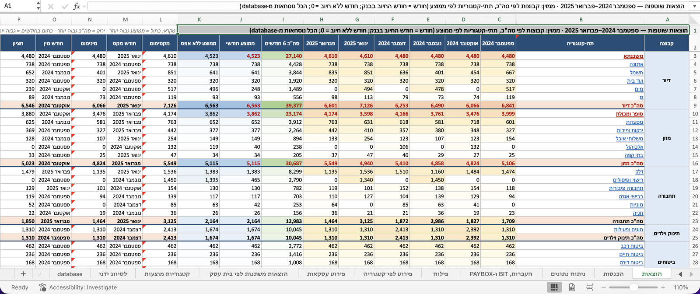

# tazrim-analysis

A Claude skill that turns your Israeli bank and credit-card exports (עובר ושב, פירוט אשראי) into a
monthly cash-flow (תזרים) analysis:

- a formula-driven Excel workbook;
- an interactive HTML dashboard;
- a Hebrew PDF report.

Any number of months, three depth levels (overview / standard / deep); everything runs locally with Claude Code.

## Demo (synthetic data)

**[▶ Open the interactive demo dashboard](https://orrzwebner.github.io/tazrim-analysis/demo/dashboard.html)** — synthetic data, opens in the browser.

[](https://orrzwebner.github.io/tazrim-analysis/demo/dashboard.html)


More: [category detail](docs/screenshots/workbook-category-detail.png) · [database](docs/screenshots/workbook-database.png) · [analysis charts](docs/screenshots/workbook-analysis.png).

All data shown is synthetic (a generated four-person household, invented merchants and amounts — not any real one).

## Install

- **Claude app — Cowork (recommended) / claude.ai:** download `tazrim-analysis.zip` from the [latest release](../../releases/latest) and upload it in **Settings → Capabilities → Skills → Upload skill**. Then, in the Claude desktop app, open **Cowork**, pick a working folder (the outputs are written there), and paste the prompt below.
- **Claude Code (plugin):** `/plugin marketplace add OrrZwebner/tazrim-analysis` then `/plugin install tazrim-analysis`.
- **Claude Code (manual):** copy `skills/tazrim-analysis/` into `~/.claude/skills/`.

## Usage

1. Download the exports from your bank and credit-card sites into a folder (anywhere on your disk): one
   עובר ושב export per account for the period, and one monthly פירוט אשראי file per billing cycle.
2. Open **Cowork** (Claude desktop app) or Claude Code.
3. Paste this prompt — it invokes the skill; fill in the two folder paths and the placeholders:

```
/tazrim-analysis נתח את התזרים שלי. קבצי הבנק וכרטיסי האשראי נמצאים בתיקייה <נתיב לתיקיית הקבצים>; שמור את הפלטים בתיקייה <נתיב לתיקיית הפלט>. תקופה: <חודש התחלה>–<חודש סיום>, רמה: <overview / standard / deep>
```

The skill guides the folder layout, asks a few methodology questions once, and builds the outputs.

## Analysis levels

| Level | What it asks of you | What you get |
|---|---|---|
| `overview` | Only the setup questions; no per-transaction labelling (unknowns are lumped into "אחר / לא מזוהה") | Basic workbook (expenses / incomes by category × month + analysis sheet), short report, no dashboard |
| `standard` | Setup questions + one round of labelling in the "לסיווג ידני" sheet for what could not be classified | Full workbook (interactive filtering, per-category detail, transactions, transfers / P2P sheet), dashboard, full report |
| `deep` | Several labelling rounds with free-text notes that Claude interprets, web research on unknown merchants, trip attribution | Everything in `standard` plus the secondary category-scheme sheet, per-trip blocks and a findings / recommendations section in the report |

Categories come from a generic, editable default scheme (`skills/tazrim-analysis/references/category-scheme-default.csv`) or from your own template workbook.

## Outputs

- `outputs/תזרים.xlsx` — the workbook: expenses and incomes by category × month with averages,
  interactive filtering, and a "לסיווג ידני" sheet where you label what it could not classify
  (your labels survive every rebuild).
- `outputs/dashboard.html` — a self-contained interactive dashboard; open it in any browser.
- `outputs/דוח.pdf` — a Hebrew report of the period.

## Requirements

- Python ≥ 3.8 and `pip install -r requirements.txt`.
- Microsoft Excel 365 to open the workbook; Google Chrome for the PDF.

## Privacy

Everything runs on your machine; the only network call is the Bank of Israel rate API.
The workbook, dashboard and report contain your data — never commit or share them.

## License

[Personal Use License](LICENSE) © 2026 Orr Zwebner. Free for private, personal use — analysing
your own household's finances — and you may modify it as you like for yourself. Anything beyond
that (commercial use, reselling, offering it or its outputs as a service, redistribution) needs
written permission. Provided as is, without warranty; this is not financial advice.
